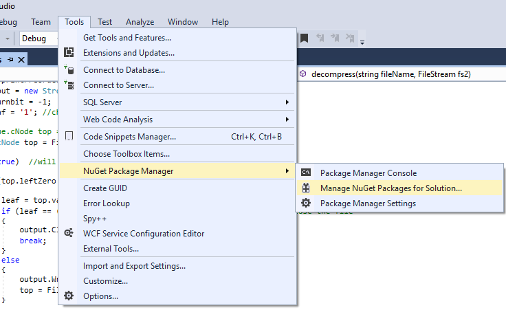
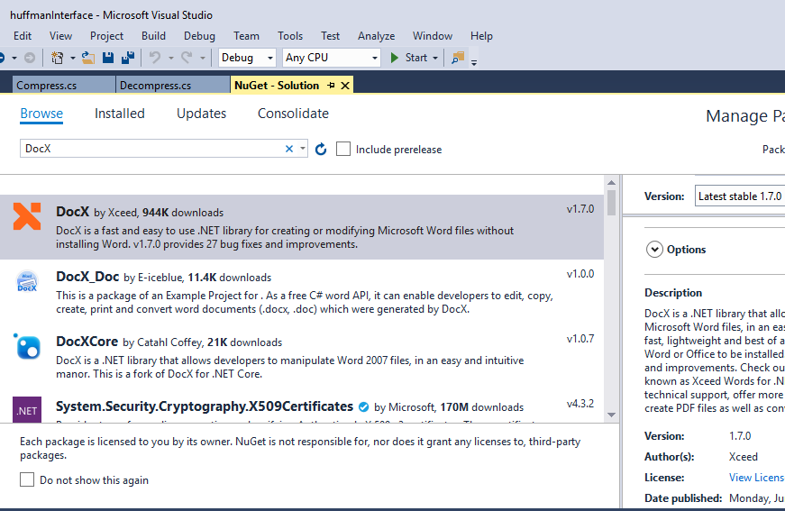

# CS311S20PID36
A File Compressor Tool that is built using WPF framework. It can compress txt, cpp, c, cs, csv, pdf, doc and docx files.
### Programming Languages, Tools and software (IDEs) used for Project implementation:

|**Sr. No.**   |  **Software** |**Version**   |**Reason** |
|---|---|---|---|
| **1**  |IDE: `Visual Studio`| Community 2017 |  It provides a wide variety of options regarding programming languages. Moreover it has a lot of stable packages which can be installed with the help of **NuGet Package Manager**. These packages help in the development of application.   |
| **2**  | Language: `C#`	| .Net Framework 4.6.1  | C# is closest to the C++ and also the best language for desktop development.   |
| **3** |  Framework: `WPF App (.Net Framework)` |  .Net Framework 4.6.1 | 	WPF is more modern then the windows form and provide a better way of making the desktop application.  |
| **4** |  Package: `iTextSharp` |  5.5.13.1 | It can manipulate the PDF file which can’t be done in simple way. In this project it is used to read data from pdf file and then create a new pdf file and write it back.  |
| **5**  | Package: `DocumentFormat.OpenXml`  | 2.11.3 | 	The Open XML SDK provides tools for working with Office Word. In this project it is used to read data from the word file.|
| **6**  | Package: `DocX`  | 	1.7.0	  |  DocX is a .NET library that allows developers to manipulate Microsoft Word files. Here it is used to create a new Word file and write data in it. |

### Project Configuration Guidelines (Step by Step):
**1.**  Download the Project from `GitHub` and open in `Visual Studio`.   
**2.**	Although Packages folder contain packages but if there are any errors you need to download the required packages from `NuGet Package Manager`.   
**3.**	At total three packages are required **iTextSharp**, **DocumentFormat.OpenXml**, **DocX**. You can download these in visual studio. Go to `Tools > NuGet Package Manager > Manage NuGet Packages for Solution`   
   
**4.**	From there in Browse Window, Search the required package.   
   
**5.**  Select the project and click install.   
   
**6.**  Run the project.   

	

	

